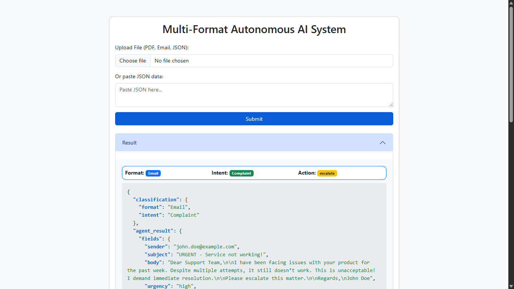

# Multi-Format Autonomous AI System with Contextual Decisioning & Chained Actions

## Overview
A multi-agent system that processes Email, JSON, and PDF inputs, classifies format and business intent, routes to specialized agents, and dynamically chains follow-up actions based on extracted data. Includes a simple web UI for uploads and result viewing.

### Agent Flow and Chaining (Diagram)


#### Textual Description:
- The user uploads a file or JSON.
- The **Classifier Agent** determines the format and intent.
- The input is routed to the appropriate specialized agent (Email, JSON, PDF).
- The agent extracts fields and suggests an action.
- The **Action Router** triggers the appropriate endpoint or chains further actions if needed.
- Actions can include CRM escalation, risk alert, logging, or closing the case.

### System Components
- **Classifier Agent**: Determines the input format (Email, JSON, PDF) and business intent.
- **Specialized Agents**: Each format has a dedicated agent for parsing and extracting relevant fields.
    - **Email Agent**: Parses and extracts data from emails.
    - **JSON Agent**: Handles structured JSON data.
    - **PDF Agent**: Extracts and processes text from PDF files.
- **Action Router**: Based on the agent's output, routes the request to the appropriate follow-up action (e.g., CRM escalation, risk alert, logging).
- **Chaining**: The router can trigger further actions or even re-invoke the classifier for chained/conditional workflows.
- **Memory Store**: Logs all actions, classifications, and traces for audit and debugging.
- **UI**: A simple web interface for uploading files, viewing results, and inspecting logs.

### Agent Logic
- **Classifier Agent**: Uses NLP and heuristics to classify the input's format and intent.
- **Email/JSON/PDF Agents**: Each agent processes its respective format, extracting fields and determining the next action.
- **Action Router**: Maps the agent's suggested action to a backend endpoint, which can be simulated or real. Supports chaining by invoking further actions based on business logic.
- **Logging**: Every step (classification, extraction, action) is logged for traceability.

## Features
- Format and intent classification (Email, JSON, PDF)
- Specialized agents for each format
- Shared memory store (SQLite)
- Action router for follow-up actions
- REST API (FastAPI)
- Simple UI
- Sample data for testing

## Project Structure
```
api/         # FastAPI app and endpoints
agents/      # Specialized agents (Email, JSON, PDF, Classifier)
router/      # Action router for chaining actions
memory/      # Memory store (SQLite-backed)
static/      # Frontend assets (js, css)
templates/   # Jinja2 HTML templates (UI)
samples/     # Example input files (PDF, JSON, Email)
requirements.txt
README.md
```

## Setup
1. **Clone the Repository**
   ```bash
git clone https://github.com/dilpreet579/multi-format-ai-system.git
cd multi-format-ai-system
```
2. **Create and Activate a Virtual Environment**
   ```bash
python -m venv venv
# On Windows:
.\venv\Scripts\activate
# On macOS/Linux:
source venv/bin/activate
```
3. **Install Dependencies**
   ```bash
pip install -r requirements.txt
```
4. **Run the API Server**
   ```bash
uvicorn api.main:app --reload
```
5. **Access the UI**
   Open [http://localhost:8000/](http://localhost:8000/) in your browser.

## API Endpoints
- `GET /` — Web UI
- `POST /upload` — Upload file or JSON (form-data: `file` or `json_data`)
- `GET /logs` — Get logs from memory
- `POST /crm/escalate` — Simulated CRM escalation
- `POST /risk_alert` — Simulated risk alert
- `POST /log_alert` — Simulated alert log
- `POST /log_and_close` — Simulated log and close

## UI Usage
- Upload a PDF, Email (.eml), or JSON file, or paste JSON data.
- View classification, intent, and action summary in the result card.
- See full trace as JSON.
- View logs in the logs panel.

## Sample Data
- Example files are in `samples/sample_jsons/`, `samples/sample_emails/`, and `samples/sample_pdfs/`.
- Use these for testing the system.

## Dependencies
- fastapi
- uvicorn
- langchain
- openai
- PyPDF2
- faker
- requests
- scikit-learn
- textblob
- python-dotenv
- python-multipart
- Jinja2
- pydantic

Install all with:
```bash
pip install -r requirements.txt
```

## Output Logs
- View logs via the UI or at `/logs` endpoint.
- Logs are stored in a SQLite database (`memory_store.db`).

## Screenshots
### 1. Web UI Home


### 2. Result Display


### 3. Logs Panel
